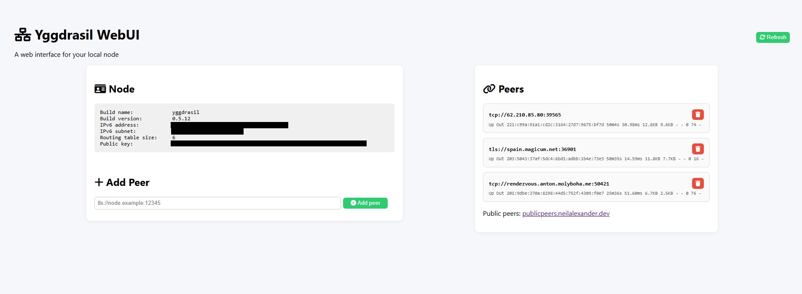

# Yggdrasil WebUI

A cross-platform web interface for managing your Yggdrasil node.

**Note:** Project done for fun with the assistance of ChatGPT.   

**Tested only with:** Windows 11 and Yggdrasil 0.5.12  

**Important:** The user must have [Yggdrasil](https://yggdrasil-network.github.io/) installed on their system to use this WebUI.

## Screenshot



## Features

- Add/remove peers
- View node information
- Refresh node and peer info
- Start/Stop service (Linux/macOS)
- Manual `yggdrasilctl` path configuration

## Installation

```bash
pip install fastapi uvicorn jinja2
uvicorn app:app --reload
